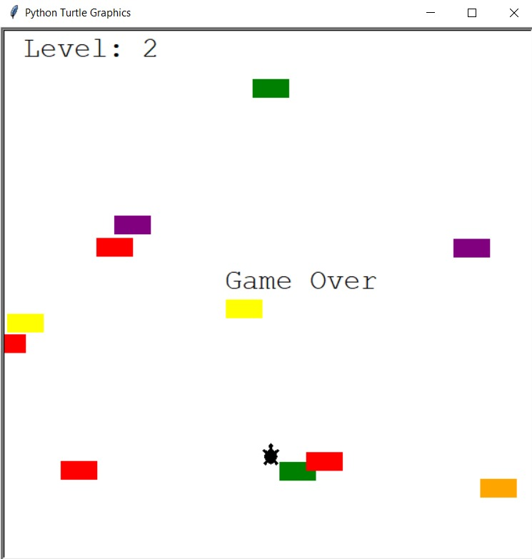

# 🐢 Turtle Crossing - Python Capstone Project

Turtle Crossing is a simple and fun arcade-style game built with Python using the `turtle` graphics module. The goal is to guide the turtle safely across a road filled with moving cars. Each time the turtle reaches the top, the level increases and the game becomes more challenging!

## 🎮 Features

- Player-controlled turtle using the Up Arrow key
- Randomly generated cars with increasing speed
- Level progression system
- Collision detection with game over message
- Object-Oriented Programming structure

## 🛠️ Technologies Used

- Python 3
- Turtle Graphics Module
- OOP Concepts

## 📚 Concepts Covered

- Object-Oriented Programming (Classes, Inheritance)
- Event Handling with `turtle.listen()`
- Collision Detection
- Game Loop Logic
- Modular Coding

## 📸 Preview

## ✅ Possible Improvements

- Add multiple lives or power-ups
- Include background music or sound effects
- Implement high score tracking
- Add left/right movement and obstacles

## 👤 Author

**Priyanshu Singh**  
GitHub: [priyan17singh](https://github.com/priyan17singh)

---

Feel free to fork this project, improve it, and have fun coding!

